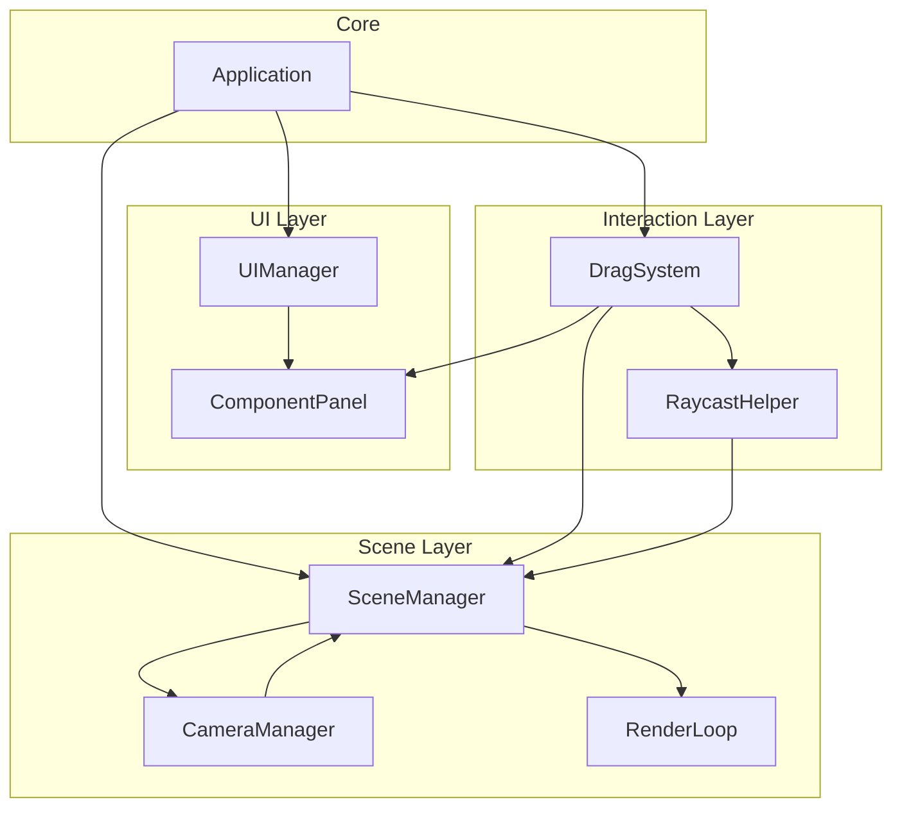

# Design Document: 3D Component Editor

## Overview

本设计文档描述了一个基于 Three.js 的简单 3D 组件编辑器的技术实现方案。该编辑器采用原生 JavaScript 开发，使用模块化架构，将 UI 层、场景管理层和交互逻辑层清晰分离。

核心设计理念：
- **简洁性**：使用 Three.js 提供的标准功能，避免过度封装
- **可扩展性**：为未来添加物体功能性和行为预留接口
- **职责分离**：每个模块专注于单一职责，便于维护和测试

## Architecture

### 系统架构图



### 模块职责

1. **Application (应用入口)**
   - 初始化所有子系统
   - 协调各模块之间的通信
   - 处理窗口大小变化事件

2. **UIManager (UI 管理器)**
   - 管理整体布局
   - 协调 ComponentPanel 和 Scene Canvas 的布局

3. **ComponentPanel (组件面板)**
   - 渲染可拖拽的几何体列表
   - 处理拖拽开始事件
   - 提供几何体配置数据

4. **SceneManager (场景管理器)**
   - 管理 Three.js Scene、Renderer
   - 添加/移除场景中的物体
   - 管理灯光和辅助对象（网格）

5. **CameraManager (相机管理器)**
   - 管理 PerspectiveCamera
   - 集成 OrbitControls
   - 处理相机更新和约束

6. **RenderLoop (渲染循环)**
   - 管理 requestAnimationFrame 循环
   - 协调场景渲染和控制器更新

7. **DragSystem (拖拽系统)**
   - 处理拖拽生命周期（开始、移动、结束）
   - 协调 UI 拖拽和 3D 场景交互
   - 创建并放置几何体实例

8. **RaycastHelper (射线检测助手)**
   - 提供射线检测功能
   - 计算鼠标位置与 3D 场景的交点

## Components and Interfaces

### 1. Application

```javascript
class Application {
  constructor(containerElement)
  init()
  handleResize()
  destroy()
}
```

**职责：**
- 作为应用的入口点和协调者
- 初始化所有子系统并建立它们之间的连接
- 监听和处理全局事件（如窗口大小变化）

**关键方法：**
- `init()`: 初始化所有模块，设置事件监听
- `handleResize()`: 响应窗口大小变化，通知相关模块更新
- `destroy()`: 清理资源，移除事件监听

### 2. UIManager

```javascript
class UIManager {
  constructor(containerElement)
  createLayout()
  getSceneContainer()
  getPanelContainer()
}
```

**职责：**
- 创建和管理应用的 DOM 结构
- 提供左右分栏布局
- 为其他模块提供容器元素引用

**布局结构：**
```html
<div class="app-container">
  <div class="component-panel"></div>
  <div class="scene-container"></div>
</div>
```

### 3. ComponentPanel

```javascript
class ComponentPanel {
  constructor(containerElement, onDragStart)
  render()
  getGeometryConfig(geometryType)
}

// 几何体配置
const GEOMETRY_CONFIGS = [
  { type: 'box', label: '立方体', icon: '□' },
  { type: 'sphere', label: '球体', icon: '○' },
  { type: 'cylinder', label: '圆柱体', icon: '⬭' },
  { type: 'cone', label: '圆锥体', icon: '△' },
  { type: 'torus', label: '圆环', icon: '◯' }
]
```

**职责：**
- 渲染几何体组件列表
- 处理拖拽开始事件，通知 DragSystem
- 提供几何体的配置信息（类型、标签、默认参数）

**交互流程：**
1. 用户在组件上按下鼠标
2. ComponentPanel 触发 `onDragStart` 回调，传递几何体类型
3. DragSystem 接管后续的拖拽逻辑

### 4. SceneManager

```javascript
class SceneManager {
  constructor(containerElement)
  init()
  addObject(mesh)
  removeObject(mesh)
  getScene()
  getRenderer()
  getCamera()
  getGroundPlane()
  resize(width, height)
  render()
}
```

**职责：**
- 初始化 Three.js 核心对象（Scene, Renderer, Camera）
- 设置场景灯光（AmbientLight + DirectionalLight）
- 添加网格辅助线（GridHelper）
- 管理场景中的物体
- 提供渲染方法

**场景配置：**
- 背景色：白色 (0xffffff)
- 环境光：强度 0.6
- 方向光：强度 0.8，位置 (5, 10, 7.5)
- 网格：20x20，灰色

**地面平面：**
- 使用一个不可见的 PlaneGeometry 作为拖拽目标
- 用于射线检测计算放置位置

### 5. CameraManager

```javascript
class CameraManager {
  constructor(camera, renderer, scene)
  init()
  update()
  updateAspect(aspect)
  getControls()
}
```

**职责：**
- 管理 PerspectiveCamera 配置
- 集成 OrbitControls
- 设置相机约束（最小极角，防止穿过地面）
- 提供相机更新方法

**相机配置：**
- FOV: 75°
- 初始位置: (5, 5, 5)
- 看向: (0, 0, 0)

**控制器配置：**
- 启用阻尼（damping）
- 阻尼系数: 0.05
- 最小极角: 0
- 最大极角: Math.PI / 2（防止相机到地面以下）

### 6. RenderLoop

```javascript
class RenderLoop {
  constructor(sceneManager, cameraManager)
  start()
  stop()
  animate()
}
```

**职责：**
- 管理 requestAnimationFrame 循环
- 每帧更新相机控制器
- 每帧渲染场景

**渲染流程：**
1. 更新 OrbitControls
2. 调用 SceneManager.render()
3. 请求下一帧

### 7. DragSystem

```javascript
class DragSystem {
  constructor(sceneManager, raycastHelper)
  startDrag(geometryType, event)
  onDragMove(event)
  onDragEnd(event)
  createGeometry(geometryType)
  placeGeometry(geometry, position)
}
```

**职责：**
- 管理拖拽状态（isDragging, currentGeometryType）
- 在拖拽过程中显示视觉反馈（可选）
- 在拖拽结束时创建几何体
- 使用 RaycastHelper 计算放置位置
- 将几何体添加到场景

**拖拽流程：**
1. `startDrag()`: 记录几何体类型，设置拖拽状态，绑定 move/end 事件
2. `onDragMove()`: 更新视觉反馈（可选实现）
3. `onDragEnd()`: 
   - 使用 RaycastHelper 计算 3D 位置
   - 调用 `createGeometry()` 创建几何体
   - 调用 `placeGeometry()` 放置到场景
   - 清理拖拽状态

**几何体创建：**
```javascript
createGeometry(geometryType) {
  const geometries = {
    'box': () => new THREE.BoxGeometry(1, 1, 1),
    'sphere': () => new THREE.SphereGeometry(0.5, 32, 32),
    'cylinder': () => new THREE.CylinderGeometry(0.5, 0.5, 1, 32),
    'cone': () => new THREE.ConeGeometry(0.5, 1, 32),
    'torus': () => new THREE.TorusGeometry(0.5, 0.2, 16, 100)
  }
  
  const geometry = geometries[geometryType]()
  const material = new THREE.MeshStandardMaterial({ 
    color: 0x00ff00,
    metalness: 0.3,
    roughness: 0.4
  })
  const mesh = new THREE.Mesh(geometry, material)
  mesh.userData.id = generateUniqueId()
  mesh.userData.type = geometryType
  
  return mesh
}
```

### 8. RaycastHelper

```javascript
class RaycastHelper {
  constructor(camera, groundPlane)
  getIntersectionPoint(mouseX, mouseY)
  screenToNDC(mouseX, mouseY)
}
```

**职责：**
- 将屏幕坐标转换为 NDC（归一化设备坐标）
- 执行射线检测
- 返回与地面平面的交点

**射线检测流程：**
1. 将鼠标屏幕坐标转换为 NDC (-1 到 1)
2. 使用 THREE.Raycaster 从相机发射射线
3. 检测与地面平面的交点
4. 返回交点的 Vector3，如果没有交点返回默认位置 (0, 0, 0)

## Data Models

### GeometryConfig

```javascript
{
  type: string,        // 'box' | 'sphere' | 'cylinder' | 'cone' | 'torus'
  label: string,       // 显示名称
  icon: string         // 图标字符
}
```

### SceneObject (Mesh.userData)

```javascript
{
  id: string,          // 唯一标识符 (UUID)
  type: string,        // 几何体类型
  createdAt: number    // 创建时间戳
}
```

### DragState

```javascript
{
  isDragging: boolean,
  geometryType: string | null,
  startEvent: MouseEvent | null
}
```

## Correctness Properties

*属性（Property）是系统在所有有效执行中应该保持为真的特征或行为。属性是人类可读规范和机器可验证正确性保证之间的桥梁。*

### Property 1: 拖拽启动状态转换

*对于任何*几何体类型，当用户在组件面板上按下鼠标时，拖拽系统应该将拖拽状态设置为激活，并记录正确的几何体类型。

**Validates: Requirements 3.1**

### Property 2: 拖拽完成创建几何体

*对于任何*几何体类型，当用户在场景画布上释放鼠标完成拖拽时，场景中应该新增一个对应类型的几何体实例。

**Validates: Requirements 3.3**

### Property 3: 射线检测位置计算

*对于任何*有效的鼠标位置，当放置几何体时，拖拽系统应该使用射线检测计算与地面平面的交点，并将几何体放置在该位置。

**Validates: Requirements 3.4, 4.1, 4.2**

### Property 4: 几何体立即渲染

*对于任何*新放置的几何体，场景应该在下一个渲染帧中显示该几何体。

**Validates: Requirements 4.3**

### Property 5: 几何体属性完整性

*对于任何*创建的几何体，它应该：
- 使用 Three.js 标准几何体类（BoxGeometry, SphereGeometry 等）
- 使用 MeshStandardMaterial 作为材质
- 拥有唯一的标识符（userData.id）
- 被添加到场景图中

**Validates: Requirements 6.1, 6.3, 6.5, 4.4**

### Property 6: 几何体 ID 唯一性

*对于任何*两个不同的几何体实例，它们的 userData.id 应该是不同的。

**Validates: Requirements 6.2**

### Property 7: 窗口调整响应

*对于任何*窗口大小变化事件，系统应该：
- 更新场景画布的尺寸
- 更新渲染器的大小和像素比
- 更新相机的宽高比
- 保持组件面板的相对宽度（20%）

**Validates: Requirements 8.1, 8.2, 8.3, 8.4**

## Error Handling

### 射线检测失败

**场景：** 用户在场景边缘或无效区域释放鼠标，射线检测未与地面平面相交。

**处理策略：**
- RaycastHelper 返回默认位置 (0, 0, 0)
- 几何体被放置在场景中心
- 不抛出错误，保持用户体验流畅

**实现：**
```javascript
getIntersectionPoint(mouseX, mouseY) {
  const intersects = this.raycaster.intersectObject(this.groundPlane)
  if (intersects.length > 0) {
    return intersects[0].point
  }
  // 默认位置
  return new THREE.Vector3(0, 0, 0)
}
```

### 无效几何体类型

**场景：** DragSystem 接收到未知的几何体类型。

**处理策略：**
- 快速失败（Fail-Fast）
- 抛出明确的错误信息
- 不创建任何几何体

**实现：**
```javascript
createGeometry(geometryType) {
  const geometries = { /* ... */ }
  
  if (!geometries[geometryType]) {
    throw new Error(`Unknown geometry type: ${geometryType}`)
  }
  
  // 创建几何体
}
```

### 渲染器初始化失败

**场景：** WebGL 不可用或初始化失败。

**处理策略：**
- 在 SceneManager.init() 中检测 WebGL 支持
- 显示友好的错误消息
- 阻止应用继续初始化

**实现：**
```javascript
init() {
  if (!WEBGL.isWebGLAvailable()) {
    const warning = WEBGL.getWebGLErrorMessage()
    this.containerElement.appendChild(warning)
    throw new Error('WebGL not available')
  }
  
  // 继续初始化
}
```

### 窗口调整过于频繁

**场景：** 用户快速调整窗口大小，触发大量 resize 事件。

**处理策略：**
- 使用防抖（debounce）限制 resize 处理频率
- 避免不必要的性能开销

**实现：**
```javascript
constructor() {
  this.resizeTimeout = null
  window.addEventListener('resize', () => {
    clearTimeout(this.resizeTimeout)
    this.resizeTimeout = setTimeout(() => {
      this.handleResize()
    }, 100)
  })
}
```

## Testing Strategy

### 测试方法

本项目采用**双重测试策略**，结合单元测试和基于属性的测试（Property-Based Testing, PBT）：

- **单元测试**：验证具体示例、边缘情况和错误条件
- **属性测试**：验证通用属性在所有输入下都成立

两种测试方法是互补的，共同提供全面的测试覆盖：
- 单元测试捕获具体的 bug
- 属性测试验证通用的正确性

### 测试框架

- **单元测试框架**：Vitest（快速、现代、与 ES 模块兼容）
- **属性测试库**：fast-check（JavaScript 的成熟 PBT 库）
- **Three.js 测试**：使用 jsdom 模拟 DOM 环境

### 属性测试配置

每个属性测试必须：
- 运行至少 **100 次迭代**（由于随机化）
- 使用注释标记引用设计文档中的属性
- 标记格式：`// Feature: 3d-component-editor, Property N: [property text]`

### 测试组织

```
test/
├── unit/
│   ├── SceneManager.test.js
│   ├── DragSystem.test.js
│   ├── RaycastHelper.test.js
│   ├── ComponentPanel.test.js
│   └── CameraManager.test.js
├── property/
│   ├── drag-lifecycle.property.test.js
│   ├── geometry-creation.property.test.js
│   ├── raycast-positioning.property.test.js
│   └── window-resize.property.test.js
└── integration/
    └── end-to-end.test.js
```

### 单元测试重点

1. **SceneManager**
   - 场景初始化（背景色、灯光、网格）
   - 添加/移除物体
   - 渲染器配置

2. **DragSystem**
   - 拖拽状态管理
   - 几何体创建逻辑
   - 事件绑定和清理

3. **RaycastHelper**
   - NDC 坐标转换
   - 射线检测计算
   - 边缘情况（无交点）

4. **ComponentPanel**
   - 组件列表渲染
   - 拖拽事件触发

5. **CameraManager**
   - 相机初始化
   - OrbitControls 配置
   - 约束设置

### 属性测试重点

1. **Property 1: 拖拽启动状态转换**
   ```javascript
   // Feature: 3d-component-editor, Property 1: 拖拽启动状态转换
   fc.assert(
     fc.property(
       fc.constantFrom('box', 'sphere', 'cylinder', 'cone', 'torus'),
       (geometryType) => {
         const dragSystem = new DragSystem(mockSceneManager, mockRaycastHelper)
         const mockEvent = createMockMouseEvent()
         
         dragSystem.startDrag(geometryType, mockEvent)
         
         return dragSystem.isDragging === true &&
                dragSystem.currentGeometryType === geometryType
       }
     ),
     { numRuns: 100 }
   )
   ```

2. **Property 2: 拖拽完成创建几何体**
   ```javascript
   // Feature: 3d-component-editor, Property 2: 拖拽完成创建几何体
   fc.assert(
     fc.property(
       fc.constantFrom('box', 'sphere', 'cylinder', 'cone', 'torus'),
       (geometryType) => {
         const sceneManager = new SceneManager(mockContainer)
         const dragSystem = new DragSystem(sceneManager, mockRaycastHelper)
         
         const initialCount = sceneManager.getScene().children.length
         
         dragSystem.startDrag(geometryType, mockMouseDownEvent)
         dragSystem.onDragEnd(mockMouseUpEvent)
         
         const finalCount = sceneManager.getScene().children.length
         
         return finalCount === initialCount + 1
       }
     ),
     { numRuns: 100 }
   )
   ```

3. **Property 3: 射线检测位置计算**
   ```javascript
   // Feature: 3d-component-editor, Property 3: 射线检测位置计算
   fc.assert(
     fc.property(
       fc.integer({ min: 0, max: 1920 }),
       fc.integer({ min: 0, max: 1080 }),
       (mouseX, mouseY) => {
         const raycastHelper = new RaycastHelper(mockCamera, mockGroundPlane)
         const position = raycastHelper.getIntersectionPoint(mouseX, mouseY)
         
         // 位置应该是有效的 Vector3
         return position instanceof THREE.Vector3 &&
                isFinite(position.x) &&
                isFinite(position.y) &&
                isFinite(position.z)
       }
     ),
     { numRuns: 100 }
   )
   ```

4. **Property 6: 几何体 ID 唯一性**
   ```javascript
   // Feature: 3d-component-editor, Property 6: 几何体 ID 唯一性
   fc.assert(
     fc.property(
       fc.array(fc.constantFrom('box', 'sphere', 'cylinder', 'cone', 'torus'), { minLength: 2, maxLength: 10 }),
       (geometryTypes) => {
         const dragSystem = new DragSystem(mockSceneManager, mockRaycastHelper)
         const ids = new Set()
         
         geometryTypes.forEach(type => {
           const geometry = dragSystem.createGeometry(type)
           ids.add(geometry.userData.id)
         })
         
         // 所有 ID 应该是唯一的
         return ids.size === geometryTypes.length
       }
     ),
     { numRuns: 100 }
   )
   ```

5. **Property 7: 窗口调整响应**
   ```javascript
   // Feature: 3d-component-editor, Property 7: 窗口调整响应
   fc.assert(
     fc.property(
       fc.integer({ min: 1024, max: 3840 }),
       fc.integer({ min: 768, max: 2160 }),
       (width, height) => {
         const app = new Application(mockContainer)
         app.init()
         
         // 模拟窗口调整
         window.innerWidth = width
         window.innerHeight = height
         app.handleResize()
         
         const renderer = app.sceneManager.getRenderer()
         const camera = app.sceneManager.getCamera()
         
         return renderer.domElement.width === width &&
                renderer.domElement.height === height &&
                Math.abs(camera.aspect - (width / height)) < 0.01
       }
     ),
     { numRuns: 100 }
   )
   ```

### 边缘情况测试

1. **射线检测失败**
   - 鼠标在场景边缘
   - 返回默认位置 (0, 0, 0)

2. **最小窗口尺寸**
   - 窗口宽度 = 1024px
   - 布局保持功能性

3. **组件列表滚动**
   - 组件数量超过视口高度
   - 滚动条正常工作

### 集成测试

**端到端拖拽流程：**
1. 初始化应用
2. 模拟在组件面板上按下鼠标
3. 模拟鼠标移动到场景
4. 模拟释放鼠标
5. 验证场景中存在新几何体
6. 验证几何体位置正确

## Implementation Notes

### 技术栈

- **核心库**：Three.js (r160+)
- **构建工具**：Vite
- **包管理器**：npm
- **测试框架**：Vitest + fast-check

### 项目结构

```
3d-component-editor/
├── src/
│   ├── main.js                 # 应用入口
│   ├── Application.js          # 应用主类
│   ├── ui/
│   │   ├── UIManager.js
│   │   └── ComponentPanel.js
│   ├── scene/
│   │   ├── SceneManager.js
│   │   ├── CameraManager.js
│   │   └── RenderLoop.js
│   ├── interaction/
│   │   ├── DragSystem.js
│   │   └── RaycastHelper.js
│   └── utils/
│       └── idGenerator.js
├── test/
│   ├── unit/
│   ├── property/
│   └── integration/
├── public/
│   └── index.html
├── package.json
├── vite.config.js
└── vitest.config.js
```

### 样式设计

使用最小化的 CSS，重点关注布局和功能性：

```css
* {
  margin: 0;
  padding: 0;
  box-sizing: border-box;
}

.app-container {
  display: flex;
  width: 100vw;
  height: 100vh;
  overflow: hidden;
}

.component-panel {
  width: 20%;
  background: #f5f5f5;
  border-right: 1px solid #ddd;
  overflow-y: auto;
  padding: 20px;
}

.component-item {
  padding: 15px;
  margin-bottom: 10px;
  background: white;
  border: 1px solid #ddd;
  border-radius: 4px;
  cursor: grab;
  user-select: none;
  display: flex;
  align-items: center;
  gap: 10px;
}

.component-item:hover {
  background: #e8f4f8;
  border-color: #0066cc;
}

.component-item:active {
  cursor: grabbing;
}

.component-icon {
  font-size: 24px;
}

.component-label {
  font-size: 14px;
  color: #333;
}

.scene-container {
  flex: 1;
  position: relative;
  overflow: hidden;
}

canvas {
  display: block;
  width: 100%;
  height: 100%;
}
```

### 性能考虑

1. **渲染优化**
   - 仅在需要时渲染（OrbitControls 更新或场景变化）
   - 考虑使用 `renderer.setAnimationLoop()` 而非 `requestAnimationFrame`

2. **事件处理**
   - 窗口 resize 事件使用防抖
   - 拖拽事件在结束时清理监听器

3. **内存管理**
   - 提供 `destroy()` 方法清理资源
   - 移除事件监听器
   - 释放 Three.js 对象（geometry, material, texture）

### 扩展性考虑

设计预留了以下扩展点：

1. **物体行为系统**
   - 在 `mesh.userData` 中存储行为配置
   - 可以添加 `BehaviorManager` 模块

2. **物体选择和编辑**
   - 可以添加 `SelectionManager` 模块
   - 使用射线检测选择场景中的物体

3. **属性面板**
   - 可以添加右侧属性面板
   - 显示和编辑选中物体的属性

4. **序列化和保存**
   - 可以添加 `SceneSerializer` 模块
   - 导出/导入场景配置（JSON 格式）

5. **撤销/重做**
   - 可以添加 `CommandManager` 模块
   - 实现命令模式记录操作历史

